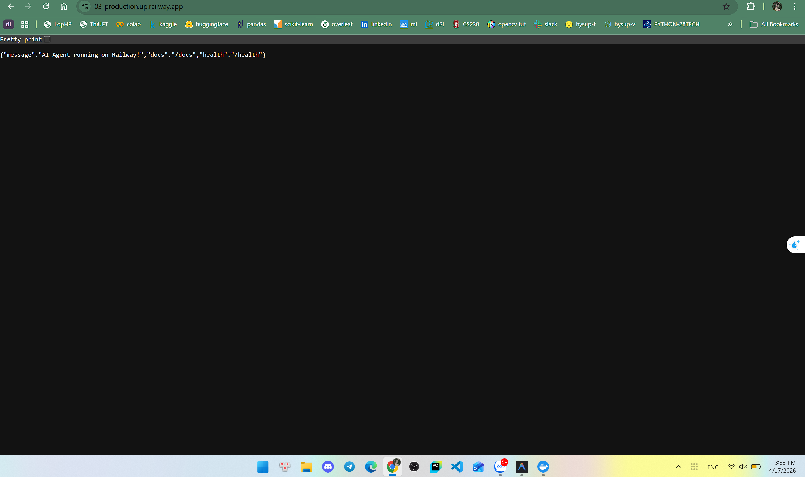

# Day 12 Lab - Mission Answers

## Part 1: Localhost vs Production

### Exercise 1.1: Anti-patterns found
1. **Hardcode API Key và Secrets:** Biến `OPENAI_API_KEY` và `DATABASE_URL` được ghi trực tiếp trong file code, gây nguy cơ rò rỉ bảo mật trầm trọng nếu mã nguồn bị lộ hoặc đưa lên GitHub.
2. **Cấu hình tĩnh (No config management):** Bật các biến như `DEBUG = True` và `MAX_TOKENS = 500` vào thẳng mã nguồn. Khi đưa lên môi trường thật rất khó cấu hình lại nếu không có biến môi trường (Environment Variable).
3. **Sử dụng lệnh `print()` sai cách và in lộ log nhạy cảm:** Ghi log bằng `print` khó xử lý phân tích lỗi trên máy chủ, ngoài ra còn để lọt lệnh in log lộ Key ra màn hình `print(f"[DEBUG] Using key: {OPENAI_API_KEY}")`.
4. **Thiếu Health Check Endpoint:** Không xây dựng API Path như `/health` nên hệ thống quản trị Cloud không thể biết được khi nào Agent Server còn phản hồi hay bị sập để tự khởi động lại.
5. **Cố định cấu hình Network (Port cứng):** Chỉ định `host="localhost"` và `port=8000` hạn chế hoàn toàn đường truyền mạng bên ngoài vào trong phần mềm, khiến Web API không thể giao tiếp qua môi trường Cloud (cần đổi sang `0.0.0.0` và nghe lệnh lấy `PORT` từ máy chủ).

### Exercise 1.3: Comparison table

| Feature | Develop | Production | Why Important? |
|---------|---------|------------|----------------|
| **Config** | Set cứng trực tiếp trong file (Hardcode) | Cấp biến từ Môi trường (Env var) | Bảo vệ tính tuyệt mật của các khóa API, dễ thao tác và tái sử dụng môi trường Server. |
| **Health check**| Không có (`None`) | Có Endpoint `/health`, `/ready` | Để Cloud có Ping theo dõi, tự động Restart / Cấp lại IP cho App nếu app bị treo đứng (Crash). |
| **Logging** | Gọi lệnh `print()` Console cơ bản | Dùng định dạng cơ sở dạng `JSON logging` | Chuẩn cấu trúc giúp máy móc hệ thống phân tích log dễ dàng bằng các phần mềm giám sát, không vô ý in biến ẩn. |
| **Shutdown** | Đột ngột ngắt kết nối hệ thống server | *Graceful shutdown* | Cho phép máy chủ bình tĩnh xử lý và trả kết quả cho xong các Chuỗi Request đang gửi dở dang rồi mới ngắt điện API một cách an toàn. |
| **Host/Port** | Khóa Host trong khu vực `localhost:8000` | Mở mạng truy cập bằng `0.0.0.0` và gọi biến `PORT` | Yêu cầu bắt buộc để Web nhận đường dẫn public ảo, giúp Cloud điều hướng tải (Load Balancer) trót lọt. |

## Part 2: Docker

### Exercise 2.1: Dockerfile questions
1. **Base image:** Cài đặt từ `python:3.11` (bản đầy đủ, khá tốn dung lượng).
2. **Working directory:** `/app` (tất cả lệnh COPY, RUN... sau đó đều thực thi tại `/app`).
3. **Tại sao COPY requirements.txt trước?:** Để tận dụng bộ đệm (Docker layer cache). Docker sẽ chỉ chạy lại lệnh `pip install` tiêu tốn nhiều thời gian nếu như nội dung file `requirements.txt` có sự thay đổi. Nếu copy toàn bộ code vào ngay từ đầu thì chỉ cần sửa 1 dòng code, hệ thống cũng bắt cài lại tất cả thư viện, rất tốn thời gian.
4. **CMD vs ENTRYPOINT khác nhau thế nào?:** `CMD` là tệp lệnh chạy mặc định khi Container khởi chạy, và bạn có xu hướng **dễ dàng ghi đè** lệnh này ở bên ngoài Terminal (VD: `docker run my-image /bin/bash`). Ở chiều ngược lại, `ENTRYPOINT` định nghĩa phần mềm cốt lõi chạy vĩnh viễn, **rất khó bị lệnh ngoài ghi đè**. Nếu dùng cả hai, giá trị của CMD sẽ bị đem vào làm tham số truyền vào lệnh khai ở ENTRYPOINT.

### Exercise 2.3: Image size comparison
- Develop: **~424 MB**.
- Production (Multi-stage build): **~56.6MB**.
- Difference: Giảm **đáng kể ~87%** dung lượng so với bản Develop.

### Exercise 2.4: Docker Compose stack
- **Các Service được Start:** Bao gồm 4 services là: `agent` (App chính), `redis` (Lưu cache/rate limit), `qdrant` (Database Vector AI), và `nginx` (Bộ điều hướng tải Load Balancer proxy).
- **Cách giao tiếp giữa các Service:** Chúng giao tiếp hoàn toàn dưới ngầm hệ điều hành thông qua một mang LAN nội bộ tên là `internal`. Không public port ra ngoài máy host. Chẳng hạn, App agent sẽ gọi Redis qua đường dẫn `redis://redis:6379`, và gọi database qua `http://qdrant:6333` bằng tính năng DNS tự động của Docker. Toàn bộ mạng lưới được canh gác bởi `Nginx` mở khóa port 80 cho người ngoài vào.

## Part 3: Cloud Deployment

### Exercise 3.1: Platform deployment
- URL: https://03-production.up.railway.app
- Screenshot: 

## Part 4: API Security

### Exercise 4.1-4.3: Test results
- **Auth Missing API key (Lỗi 401):** `{"detail": "Missing API key. Include header: X-API-Key: <your-key>"}` 
- **Auth Valid API key (200 OK):** `{"question": "hello", "answer": "..."}`
- **Test Rate Limiter (Quá tải):** Sau khi vượt quá 10 queries, báo lỗi `HTTP 429 Too Many Requests:  Rate limit exceeded`.
- **Thuật toán áp dụng:** Thuật toán chặn tin nhắn được áp dụng là `Sliding Window Counter` (với giới hạn 10 câu hỏi / 60 giây). Cách này trượt theo thời gian chẵn thay vì nhảy cục thành từng phút, giúp cho lưu lượng mượt mà và tránh bị nghẽn mạng lúc vừa chuyển giao phút cũ với phút mới.

### Exercise 4.4: Cost guard implementation
**Cách tiếp cận (My Approach):** 
Để vượt qua giới hạn chi phí "gọi API OpenAI phá sản", bài toán giới hạn ngân sách (budget) được cấu hình ngay lập tức trước khi gọi LLM theo 3 tầng kiểm tra:
1. **Kiểm tra mức trần toàn hệ thống (Global Budget):** Tối đa 10 USD/ngày. Nếu lố ngưỡng này do bị tấn công tập thể, sẽ chốt chặn lại và báo Error 503 (Cứu sập Server).
2. **Kiểm tra theo từng cá nhân (Per-User):** Tối đa 1 USD/ngày. Nếu ráng request lố thì báo lỗi 402 Payment Required (Bắt nạp thẻ cào).
3. **Cách thức đếm:** Bóc và định giá lưu lượng Input Tokens / Output Tokens của cái request mà LLM trả về, sau đó nhân với đơn giá cố định để cộng dồn vào thư viện bộ nhớ tổng của người dùng. Xuất log Warning màu vàng Cảnh Cáo nếu người dùng đã xài quá 80% quota trong ngày.

## Part 5: Scaling & Reliability

### Exercise 5.1-5.5: Implementation notes
**1. Liveness probe vs Readiness probe:**
- **Liveness (`/health`):** Báo cáo tình trạng sống còn. Nếu server cạn Memory hoặc app bị đơ/chết lâm sàng, nền tảng Cloud (VD: Kubernetes, Railway) đọc tín hiệu này lập tức ra lệnh tiêu hủy và Restart lại cái Container mới (tránh treo máy diện rộng).
- **Readiness (`/ready`):** Báo cáo độ sẵn sàng. Nếu AI Model trên máy chưa load xong 100% hoặc đang mất mạng kết nối tới Database, app sẽ giơ biển 503 Not Ready. Thấy vậy, điều phối viên (Load Balancer) sẽ không ném request của khách hàng mới vào chiếc máy chủ này để tránh làm rớt chat (điều phối đi máy khác), chờ tới khi nó sẵn sàng tiếp.

**2. Tại sao cần Graceful Shutdown?:**
Khi có sự cố cần đem server đi bảo trì hoặc tắt đột ngột, cơ chế Graceful Shutdown sẽ lắng nghe trước cái tín hiệu báo tử của hệ điều hành (`kill -SIGTERM`). Tức thì, nó chốt cổng không nhận thêm câu hỏi mới nữa, nhưng vẫn tận tụy cho máy móc chạy vớt vát thêm 30 giây nhằm xử lý và gửi câu trả lời cho kì xong các đoạn hội thoại đang gửi lơ lửng (`in_flight_requests`). Giúp người dùng App không bị chịu cảnh tự dưng văng lỗi ngắt kết nối (502 Bad Gateway) cái rụp.

**3. Khái niệm Stateless Agent & Nginx Load Balancing:**
Trong thư mục `05/production/`, Agent đã được cải tạo thành **Stateless (Vô ngã)**:
- Tức là nó không còn lưu nhớ bất kỳ lịch sử chat gì trong bộ nhớ não RAM của máy chủ cục bộ nữa. Bất cứ người dùng nào có đoạn hội thoại mới (Session) đều được đẩy ra nhà kho trung tâm **Redis**.
- Khi chạy lệnh scale nhân bản lên 3 server AI cùng lúc (`docker compose up --scale agent=3`), hệ thống Nginx sẽ chia bài và chia tải đồng đều cho 3 máy. Ngay cả khi gặp sự cố 1 máy bị nổ tung, 2 máy còn lại lập tức gánh khách mà người dùng không hề hay biết do máy nào cũng có quyền chạy đến nhà kho Redis để lôi lại trí nhớ cũ ra tiếp tục trò chuyện!
